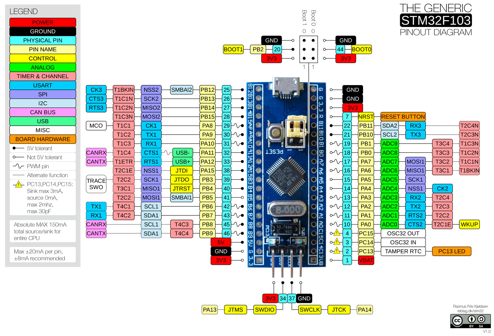
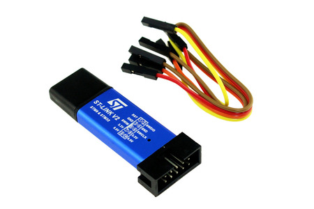

# Rust Blue Pill Quickstart


## Hardware

* [Blue Pill](https://stm32-base.org/boards/STM32F103C8T6-Blue-Pill.html) Minimum System Development board



* ST-Link V2 USB Programmer



```bash
# download the OpenOCD rules file and copy it to the right location
wget -O 60-openocd.rules https://sf.net/p/openocd/code/ci/master/tree/contrib/60-openocd.rules?format=raw
sudo cp 60-openocd.rules /etc/udev/rules.d

# ask the udev daemon to reload these rules
sudo udevadm control --reload
```

## Dependencies for Debian Buster

* VS Code with the Rust and Cortex-Debug add-ins
If you have the `code` command in your path, you can run the following commands to install the necessary extensions.

```sh
code --install-extension rust-lang.rust
code --install-extension marus25.cortex-debug
```

* The thumbv7m-none-eabi Rust target
```bash
rustup target add thumbv7m-none-eabi
```

* OpenOCD
```bash
sudo apt-get install openocd
```

* GDB

```bash
# or gdb-arm-none-eabi on some other Linux distros
sudo apt-get install gdb-multiarch

# workaround: the current version of the cortex-debug doesn't allow you to specify the name of the gdb executable
sudo ln -s /usr/bin/gdb-multiarch /usr/bin/arm-none-eabi-gdb
```

## Run and Debug

Just put a breakpoint where you want it and press F5
